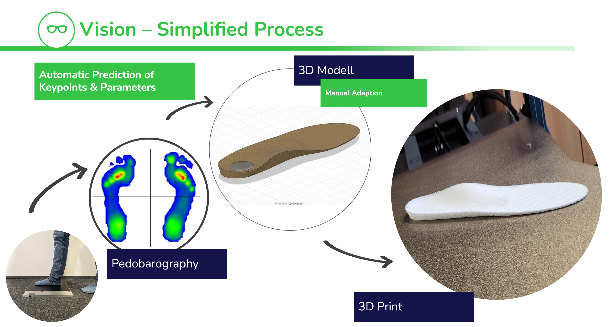
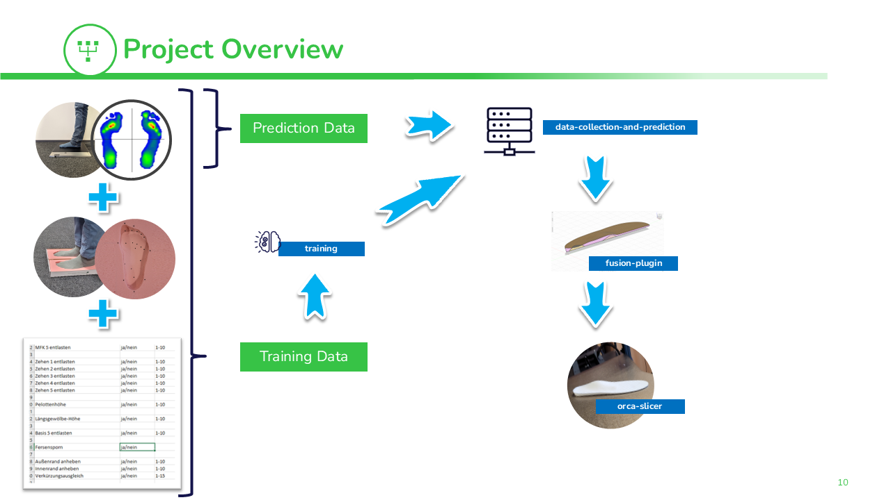

 

  <h1 align="center">Training and Prediction Toolbox for 3D Printable Orthopedic Insoles</h1>
  
  

    <a href="">Report Bug</a>
    ·
    <a href="">Request Feature</a>
  

   

  

    
     
    <h3 align="center"><strong>Green-AI Hub Mittelstand</strong></h3>
    <a href="https://www.green-ai-hub.de"><u>Homepage</u></a> 
    | 
    <a href="https://www.green-ai-hub.de/kontakt"><u>Contact</u></a>
  
   
  

 

# About the Project
This toolbox was developed by the German Research Center for AI (DFKI) as part of the Green-AI Hub Mittelstand funded by the German ministry of Federal Ministry for the Environment, Nature Conservation, Nuclear Safety and Consumer Protection of Germany and managed by the "Zukunft - Umwelt - Gesellschaft" (ZUG).

The project was a collaboration between the DFKI and the Herges GmbH. Its aim was the automatic prediction of parameters of a 3D model of orthopedic insoles which can be printed by a 3D printer solely based on digital pedobarography. 

The repositories that you find here contain all the necessary software to collect, train, predict and transfer insole data to Autodesk Fusion 360.

It does not include the base 3D model of the insole or the training data. These need to be collected for future projects.

## Table of Contents

  

  <ol>
    <li>
      <a href="#about-the-project">About The Project</a>
    </li>
    <li><a href="#table-of-contents">Table of Contents</a></li>
    <li><a href="#overview">Project Overview</a></li>
    <li><a href="#contributing">Contributing</a></li>
    <li><a href="#license">License</a></li>
    <li><a href="#contact">Contact</a></li>
  </ol>

# General Mode of Operation

The prototype in this repository demonstrates how insoles can be created via a pedobarography. First the customer walks over a pressure plate to collect the pedobarography data. This data is then fed into the ML model which will predict several keypoints and parameters such as the length of the insole, where relieves need to be placed, etc.. These parameters are then transferred to Autodesk Fusion 360 where the parameters are applied to a base model of an insole via the plugin provided. Finally, a modified version of Orca Slicer observes the infill settings that are exported via Fusion 360.

# Project Overview

The toolbox consists of several repositories that form the final prototype:
- `datacollection-and-prediction` - contains all software to collect, label, and predict data
- `training` - contains Jupyter notebooks to train the model
- `fusion-plugin`  - contains a fusion plugin that can load insole parameters directly into Fusion 360
- `orca-slicer`  - a slightly adapted Orca Slicer that allows for loading infill parameters from Fusion 360 Body names

For training, `datacollection-and-prediction` and `training` is used. See the individual subdirectories for more documentation.

To predict and print insoles `datacollection-and-prediction`, `fusion-plugin` and `orca-slicer` is used. Again, see the individual subdirectories for more details.

## Contributing

Contributions are what make the open source community such an amazing place to learn, inspire, and create. Any contributions you make are **greatly appreciated**.

If you have a suggestion that would make this better, please fork the repo and create a pull request. You can also simply open an issue with the tag "enhancement".
Don't forget to give the project a star! Thanks again!

1. Fork the Project
2. Create your Feature Branch (`git checkout -b feature/AmazingFeature`)
3. Commit your Changes (`git commit -m 'Add some AmazingFeature'`)
4. Push to the Branch (`git push origin feature/AmazingFeature`)
5. Open a Pull Request

(<a href="#readme-top">back to top</a>)

## License

If not otherwise specified, all code is distributed under the GPLv3 License. See the `LICENSE` file for more information.

(<a href="#readme-top">back to top</a>)

## Contact

Green-AI Hub Mittelstand - info@green-ai-hub.de

Project Link: https://github.com/Green-AI-Hub-Mittelstand/xxx

 
  <a href="https://www.green-ai-hub.de/kontakt"><strong>Get in touch »</strong></a>
 
 

    

(<a href="#readme-top">back to top</a>)

