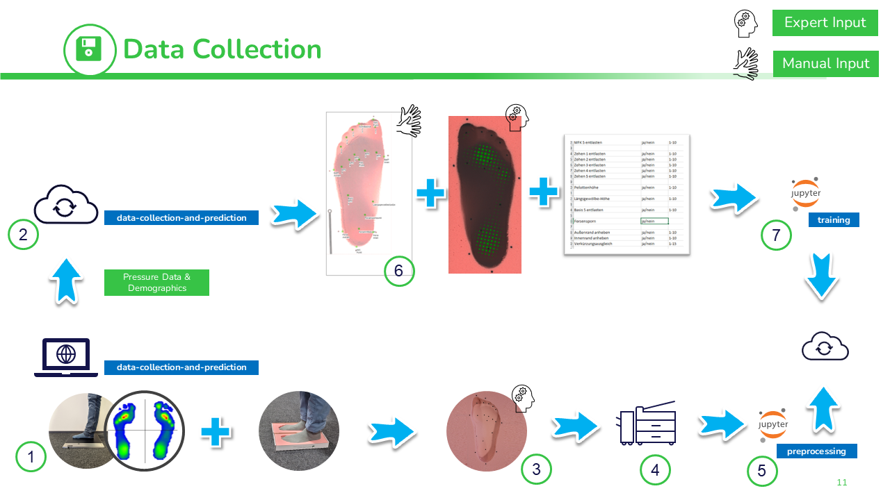
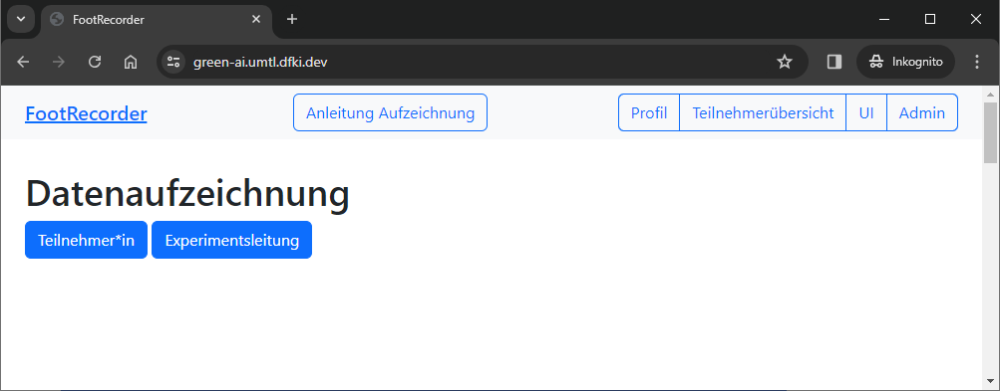
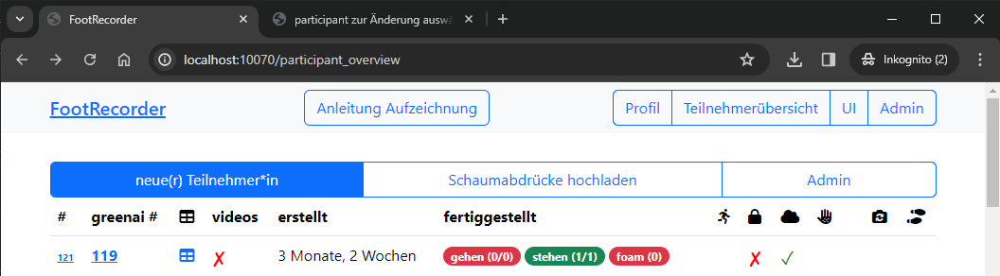
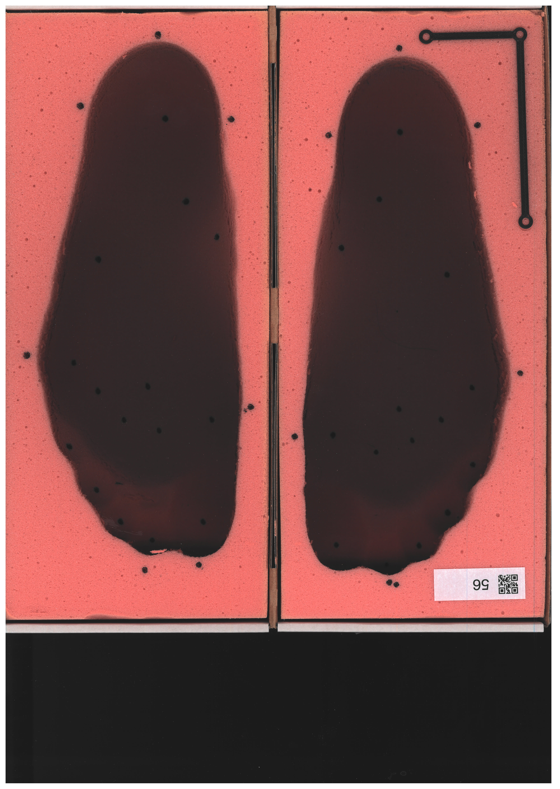
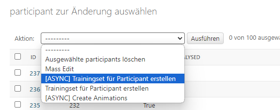
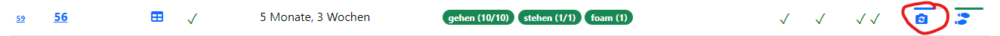
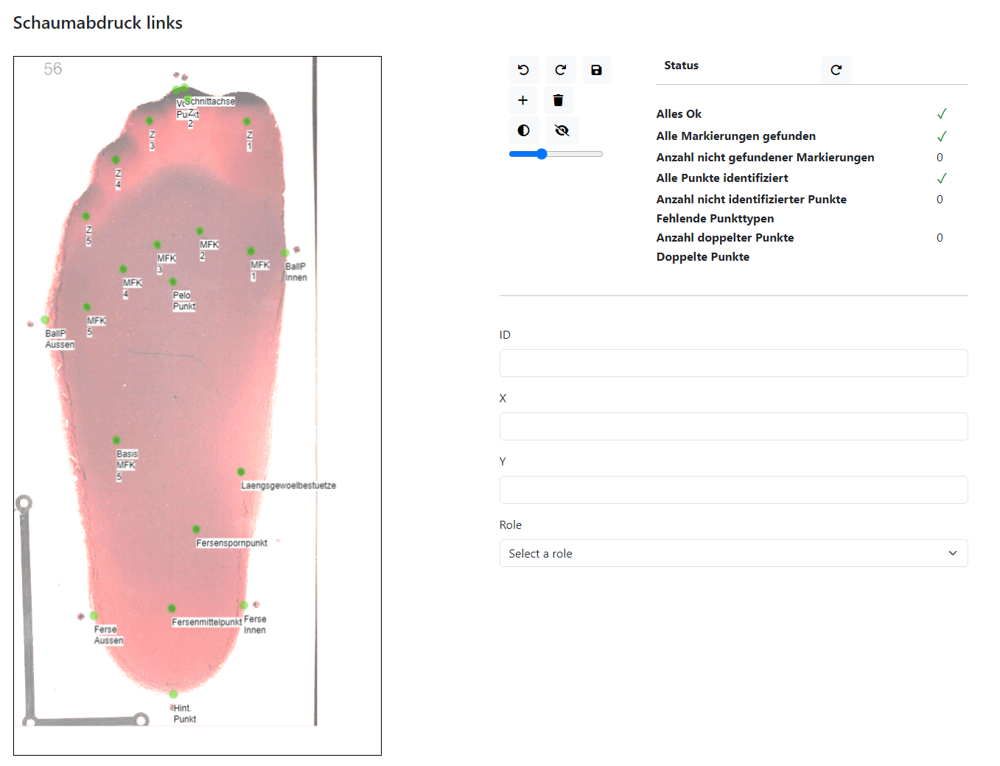
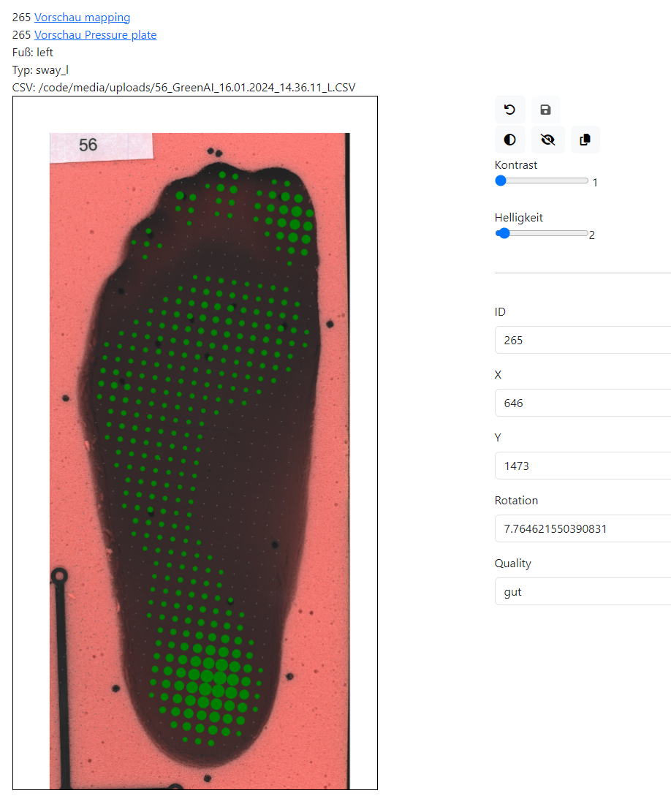
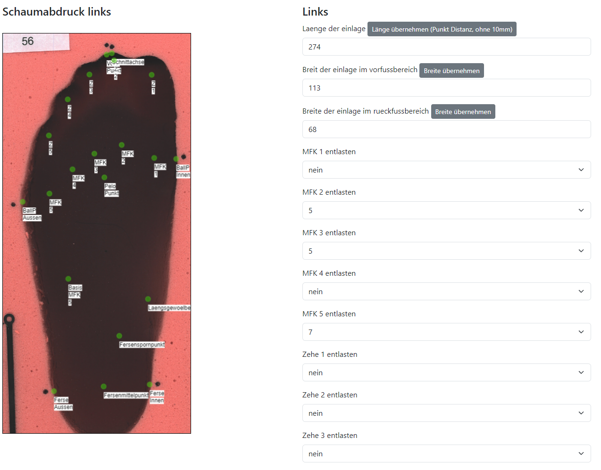

<a name="readme-top"></a>


<br />
<div align="center">
  <h1 align="center">Training and Prediction Toolbox for 3D Printable Orthopedic Insoles</h1>
  <h2 align="center">Data Collection and Prediction</h2>
  
  <p align="center">
    <a href="">Report Bug</a>
    ·
    <a href="">Request Feature</a>
  </p>

  <br />

  <p align="center">
    <a href="https://www.green-ai-hub.de">
    
  </a>
    <br />
    <h3 align="center"><strong>Green-AI Hub Mittelstand</strong></h3>
    <a href="https://www.green-ai-hub.de"><u>Homepage</u></a> 
    | 
    <a href="https://www.green-ai-hub.de/kontakt"><u>Contact</u></a>
  
   
  </p>
</div>

<br/>

This Django Project is used to collect training data and doubles as user interface to predict the insole parameters.


## Setup
Everything is dockerized, so after setting up your [local_settings.py](./dataCollection/settings_local.py.template) file,  a simple `docker compose up` should suffice.
By default the GUI is reachable via `http://127.0.0.1:10070/`


Use `docker compose exec web bash` to bash into the docker container to create a superuser.
```
cd /code
python manage.py createsuperuser
```

## Architecture
The Django Project can be setup as server client architecture. Both client and server share the same code but allow for synchronizing data between client and server. This was used to have a single unified data repository so the people working on data collection could push their data and machine learning experts were able to fetch this data to work on a local machine.

## Collecting Training Data



The general process for data collection is as follows.
1. Collection of participant data: digital pedobaragraphy, foam imprint, and demographic data + prior injuries & pain points
2. Pedobarography and demographics are uploaded to server
3. The expert labels the foam prints
4. Foam prints are scanned via a Xerox AltaLink C8030
5. Data is preprocessed and uploaded to the cloud
6. Server side preparation of data and manual rework of detected points. Expert aligns digital pressure data with foam print and sets parameters for insole.
7. Training data is downloaded from server and fed into training pipelines. Models are manually uploaded to the cloud to allow for prediction.


### 1) Collection of Participant Data

On the main screen, either the participant view (Teilnehmer*in) or experimenter view (Experimentsleitung) can be selected.

For each new participant, a new entry needs to be started. This is done via the experimenter view (neue(r) Teilnehmer*in erstellen).

Clicking on this, will lead the experimenter to a guided process to collect the data. See `http://localhost:10070/recording-instructions` for detailed instructions.

The participant view is supposed to be viewed on a tablet which can be handed to the participant. This includes a privay declaration as well as a questionnaire. The privacy declaration needs to be adapted here [./participants/templates/participant_data_protection*](./participants/templates/participant_data_protection.html)

For the data collection, the following pressure plate was used: *Druckmessplatte NX (WLAN) by medilogic* `https://medilogic.com/de/druckmessplatte-nx/`.

### 2) Uploading Pressure Data and Questionnaires
Data can be uploaded via a Django management command

```
docker compose exec web bash
cd /code
python manage.py uploadParticipant
```

### 3) Expert Labeling of Foam Prints
The expert needs to label the foam prints. We used a Edding / Sharpie for this. See [./dataInspection/helpers/pois.py](./dataInspection/helpers/pois.py) for a fixed list of mandatory points. This will also be the points that are predicted by the pipeline. The outer points (0, 18, 19, 20, 21) need to set slightly offset to the perimeter line of the foam print.

### 4) Scanning of Labeled Foam Prints
We use a  Xerox AltaLink C8030 to scan the labeled foam prints. For this, press the skaling triangle (printed out of black PLA [./skaling_triangle.stl](./skaling_triangle.stl)) in the bottom left corner of a foam print box. 

The following settings were used to scan the foam prints:
- 300 DPI
- DIN A3 landscape
- Color
- Fileformat: JPG

Please orient the foam box so that the feet point downwards as seen below.



### 5) Preprocessing
After scanning, the QR Codes can be used to automatically rename the files so that they can be uploaded to the cloud. This is done via the notebooks in `preprocessing`. Please see there for more details. 

### 6) Server Side Preparation of Training Data
The preparation of training data requires multiple steps:
 

#### 1) Triggering Generation of Foam Print Analysis
After uploading all required data, the generation of foam print analysis can be triggered via the admin interface `http://127.0.0.1:10070/admin/participants/participant/`. For this, select the participants, and in the action drop down, select `[ASYNC] Trainingset für Participant erstellen`. This will queue the generation in the background. 



#### 2) Fixing Possible Detection Errors
After that, switch to the participant overview, and select the camera icon


This will lead you to the point editor. Drag and drop points to there appropriate position or create/delete points. Also use the dropdown to set the appropriate role. The indicator on the right will inform you if everything seems correct. This is a manual task which does not involve expert knowledge.



#### 3) Aligning Digital Pressure Images to Foam Box Images
In the same screen, scroll down to the individual digital pressure images. These need to be aligned via drag and drop to match the foam print as good as possible. Use the sliders to modify contrast and brightness. There is also the possibility to assign a mapping quality. This is an expert task.


#### 4) Setting Insole Parameters
Finally, by selecting the soleprint icon in the participant overview, the expert can set the parameters of the insole. This concludes the preparation of the training data.


### 7) Training the Model
Please follow the documentation in `training`-  


<a name="license"></a>
## License

The code is distributed under the MIT License. See the `LICENSE` file for more information.

<p align="right">(<a href="#readme-top">back to top</a>)</p>
