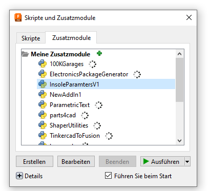
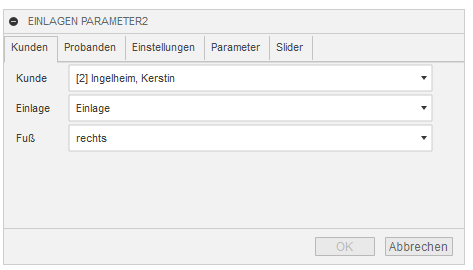
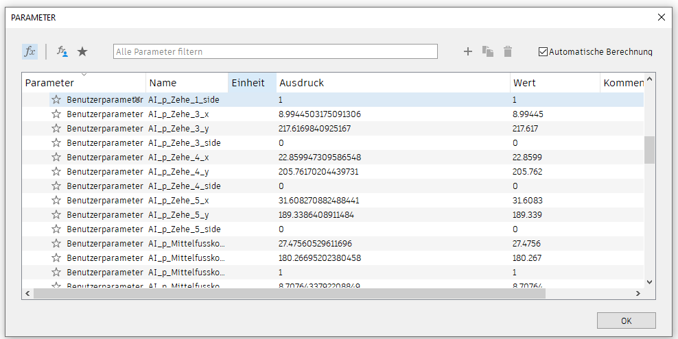

 

  <h1 align="center">Training and Prediction Toolbox for 3D Printable Orthopedic Insoles</h1>
  <h2 align="center">Fusion Plugin</h2>
  
  

    <a href="">Report Bug</a>
    ·
    <a href="">Request Feature</a>
  

   

  

    
     
    <h3 align="center"><strong>Green-AI Hub Mittelstand</strong></h3>
    <a href="https://www.green-ai-hub.de"><u>Homepage</u></a> 
    | 
    <a href="https://www.green-ai-hub.de/kontakt"><u>Contact</u></a>
  
   
  

 

# Overview

This plugin is used to load data directly from the `datacollection-and-prediction` project into Fusion 360.  

# Setup
Follow the instructions in how to manually install an AddIn as described on the Autodesk website: https://www.autodesk.com/support/technical/article/caas/sfdcarticles/sfdcarticles/How-to-install-an-ADD-IN-and-Script-in-Fusion-360.html

Then rename the `user-config.json_template` to `user-config.json`.

Set the parameters according to the hosting, tokens, and the secrets defined in the `datacollection-and-prediction dataCollection/settings_local.py` file.

# Usage
Start the AddIn via the Service Utils Tab:

Select the customer or participant you want to load the parameters from.

Parameters are loaded as user parameters with the prefix `AI_p_`

## License

The code is distributed under the MIT License. See the `LICENSE` file for more information.

(<a href="#readme-top">back to top</a>)

